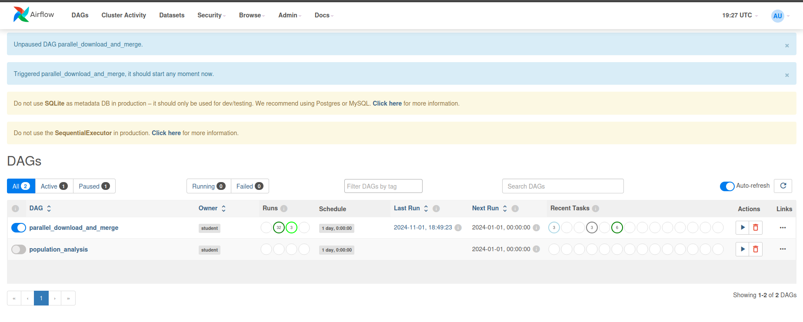

# Apache Airflow Playground con Docker Compose

Este repositorio contiene una práctica de DevOps en la que configuramos y ejecutamos un entorno de **Apache Airflow** en contenedores Docker. Además, creamos un nuevo DAG con tareas en paralelo para descargar datos, hacer merge de los archivos descargados y generar un informe combinado.

## Requisitos Previos

- [Docker](https://www.docker.com/get-started)
- [Docker Compose](https://docs.docker.com/compose/install/)
- [Git](https://git-scm.com/downloads)

## Puesta en Marcha

1. **Clonar el Repositorio**  
   Clona este repositorio en tu máquina local:

   ```sh
   git clone https://github.com/tu-usuario/airflow-with-docker-compose-playground.git
   cd airflow-with-docker-compose-playground
   ```

2. **Iniciar los Servicios con Docker Compose**  
   Inicia los contenedores de Docker:

   ```sh
   docker-compose up -d
   ```

3. **Obtener la Contraseña de Admin**  
   En los logs, busca la línea que contiene `admin:password` para encontrar la contraseña de acceso al panel de Apache Airflow:

   ```sh
   docker-compose logs airflow | grep admin
   ```

   


4. **Acceder a la Interfaz Web de Airflow**  
   Abre [http://localhost:8001](http://localhost:8001) en tu navegador. Ingresa el usuario `admin` y la contraseña que obtuviste en el paso anterior.

   

5. **Ejecutar el DAG `parallel_download_and_merge`**  
   - En la interfaz de Airflow, habilita el DAG `parallel_download_and_merge`.
   - Ejecútalo manualmente para que las tareas se procesen en el orden indicado: descargas paralelas, merge de datos, y generación de informe.

6. **Verificar el Informe Generado**  
   Una vez que el DAG finalice, revisa el archivo `combined_report.txt` generado en el contenedor. Puedes verlo directamente en la terminal:

   ```sh
   cat /tmp/combined_report.txt
   ```

   

## Resolución de Problemas Comunes

- **Si el DAG no aparece en la interfaz de Airflow:**  
  Verifica que el archivo del DAG esté en la carpeta `dags/` y que no haya errores de sintaxis. Reinicia los servicios si es necesario:

  ```sh
  docker-compose restart
  ```

- **Si el puerto 8001 está ocupado:**  
  Puedes cambiar el puerto en `docker-compose.yaml` reemplazando `8001` por otro puerto disponible.

- **Problemas de permisos en la carpeta `outputs/`:**  
  Asegúrate de que la carpeta tenga permisos de escritura:

  ```sh
  chmod -R 777 outputs/
  ```

## Estructura de Archivos del Proyecto

```plaintext
.
├── README.md
├── docker-compose.yaml
├── .env
├── dags/
│   └── parallel_download_pipeline.py
└── outputs/
    └── combined_report.txt
```

Con estos pasos, podrás replicar la configuración y ver los resultados del pipeline de datos en Apache Airflow. ¡Buena suerte!
